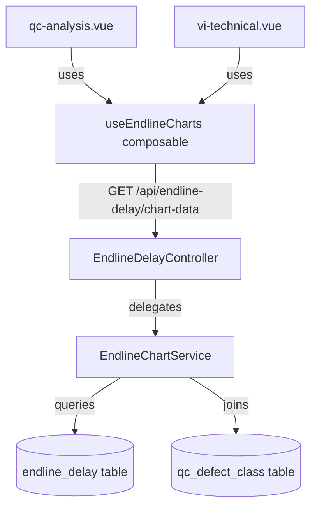
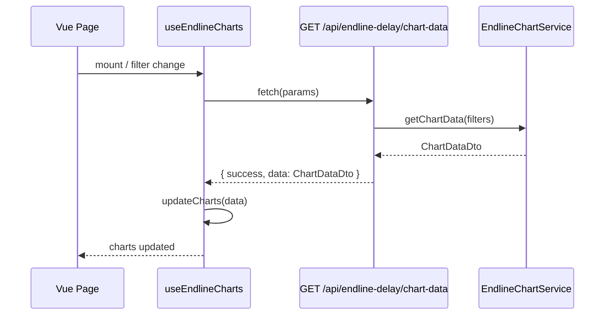
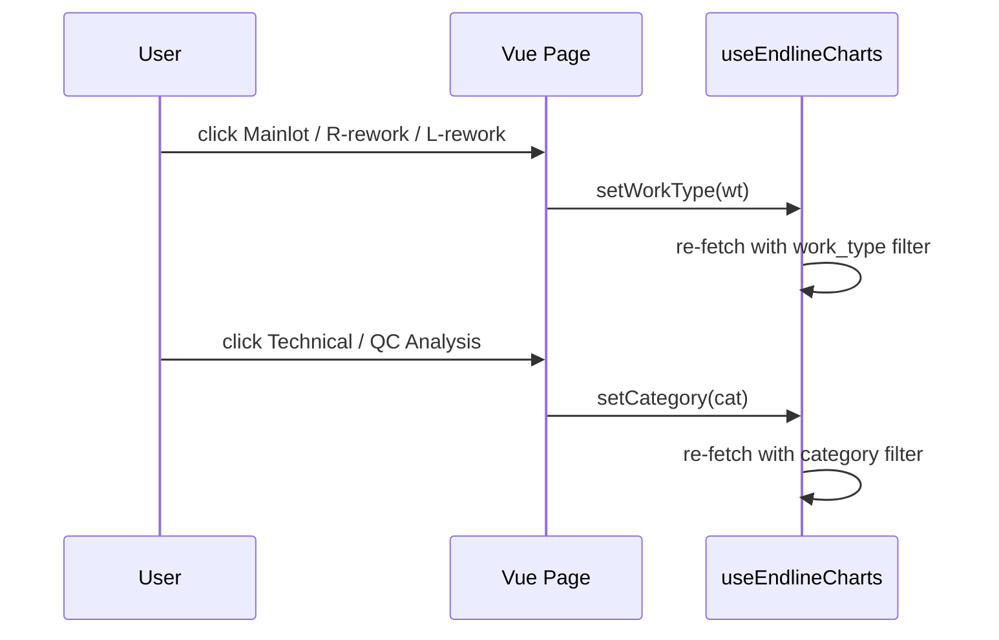

# Design Document: Endline Charts Visualization

## Overview

Wire the three-chart section (pie, horizontal stacked bar, stacked column) in the QC Analysis and VI Technical monitoring pages to real data from the `endline_delay` table. The charts currently render with static placeholder data; this feature replaces that with live aggregated data fetched from a new backend API endpoint, reacting to the same date/shift/cutoff/worktype/lipas filters already present on each page.

The two pages share identical chart structure but differ only in their default `defect_class` scope (`"QC Analysis"` vs `"Tech'l Verfication"`). A single shared composable (`useEndlineCharts`) will own all chart lifecycle and data-fetching logic, keeping both pages DRY.

---

## Architecture



---

## Sequence Diagrams

### Chart Data Load Flow



### Column Chart Toggle Flow



---

## Components and Interfaces

### Backend: EndlineChartService

**Purpose**: Aggregate raw `endline_delay` rows into the three chart datasets.

**Interface**:

```typescript
interface ChartFilters {
    date?: string; // YYYY-MM-DD
    shift?: string; // DAY | NIGHT
    cutoff?: string; // 00:00~03:59 | ...
    work_type?: string; // NORMAL | PROCESS RW | WH REWORK | OI REWORK
    lipas_yn?: string; // Y | N
    defect_class: string; // "QC Analysis" | "Tech'l Verfication"
    work_type_filter?: string; // Mainlot | R-rework | L-rework (column chart toggle)
    category?: string; // Technical | QC Analysis (column chart toggle)
}

interface ChartDataDto {
    pie: {
        labels: string[]; // ["Mainlot", "R-rework", "L-rework"]
        series: number[]; // lot counts per work-type bucket
    };
    bar: {
        categories: string[]; // ["03", "05", "10", "21", "31", "32"]
        series: Array<{
            name: string; // "Mainlot" | "R-rework" | "L-rework"
            data: number[]; // lot counts per size
        }>;
    };
    column: {
        categories: string[]; // defect_name values from qc_defect_class
        series: Array<{
            name: string; // lot_size code e.g. "03"
            data: number[]; // lot counts per defect category
        }>;
    };
}
```

**Responsibilities**:

- Apply the same date/shift/cutoff/work_type/lipas filters as `buildQuery()` in the controller
- Classify rows into Mainlot / R-rework / L-rework buckets based on `work_type`
- Derive `lot_size` from `model` field (characters at position 0–1, matching `03|05|10|21|31|32`)
- Join `qc_defect_class` on `qc_defect` = `defect_code` to get `defect_name` for column chart x-axis
- Filter column chart data by `work_type_filter` (Mainlot/R-rework/L-rework) and `category` (Technical/QC Analysis via `defect_class` on the joined table)

### Frontend: useEndlineCharts Composable

**Purpose**: Owns ApexCharts instances, fetches data, and updates charts reactively.

**Interface**:

```typescript
interface UseEndlineChartsOptions {
    chartIdPrefix: string; // "qc" | "vi"
    defaultCategory: 'QC Analysis' | 'Technical';
    getParams: () => Record<string, string | undefined>;
}

interface UseEndlineChartsReturn {
    activeWorkType: Ref<'Mainlot' | 'R-rework' | 'L-rework'>;
    activeCategory: Ref<'Technical' | 'QC Analysis'>;
    setWorkType: (wt: 'Mainlot' | 'R-rework' | 'L-rework') => void;
    setCategory: (cat: 'Technical' | 'QC Analysis') => void;
    fetchChartData: () => Promise<void>;
    initCharts: () => void;
    destroyCharts: () => void;
}
```

**Responsibilities**:

- Initialize three ApexCharts instances using the `chartIdPrefix` to target DOM IDs
- Call `GET /api/endline-delay/chart-data` with merged page filters + chart-specific filters
- Call `chart.updateOptions()` / `chart.updateSeries()` on data change (no destroy/re-init)
- Expose `setWorkType` and `setCategory` which update reactive state and re-fetch
- Clean up chart instances on `onBeforeUnmount`

---

## Data Models

### Work-Type Bucketing

The `work_type` column in `endline_delay` maps to the three pie/bar series:

| DB `work_type` value | Chart bucket       |
| -------------------- | ------------------ |
| `NORMAL`             | Mainlot            |
| `PROCESS RW`         | R-rework           |
| `WH REWORK`          | R-rework           |
| `OI REWORK`          | L-rework           |
| `null` / other       | Mainlot (fallback) |

### Lot Size Derivation

`endline_delay` has no `lot_size` column. Size is derived from the `model` field:

- Characters at index 8–9 of `model_15` (the standard 15-char model code) encode the size
- Known size codes: `03`, `05`, `10`, `21`, `31`, `32`
- SQL: `SUBSTRING(model, 9, 2)` — if the result is not in the known set, the row is excluded from the bar chart

### Column Chart Filtering

The column chart has two independent toggle groups:

1. **Work-type toggle** (Mainlot / R-rework / L-rework): filters rows by the bucketing above
2. **Category toggle** (Technical / QC Analysis): filters by `defect_class` on the `endline_delay` row itself (not the joined table), since each row already carries its own `defect_class`

The x-axis categories are the distinct `defect_name` values from `qc_defect_class` where `defect_flow` matches the active category filter, ordered by `defect_code`.

---

## API Endpoint

### GET `/api/endline-delay/chart-data`

**Query parameters** (all optional):

| Param              | Type   | Description                                          |
| ------------------ | ------ | ---------------------------------------------------- |
| `date`             | string | YYYY-MM-DD                                           |
| `shift`            | string | DAY \| NIGHT                                         |
| `cutoff`           | string | cutoff range string                                  |
| `work_type`        | string | page-level worktype filter                           |
| `lipas_yn`         | string | Y \| N                                               |
| `defect_class`     | string | page scope: "QC Analysis" or "Tech'l Verfication"    |
| `work_type_filter` | string | column chart toggle: Mainlot \| R-rework \| L-rework |
| `category`         | string | column chart toggle: Technical \| QC Analysis        |

**Response**:

```json
{
    "success": true,
    "data": {
        "pie": {
            "labels": ["Mainlot", "R-rework", "L-rework"],
            "series": [42, 18, 7]
        },
        "bar": {
            "categories": ["03", "05", "10", "21", "31", "32"],
            "series": [
                { "name": "Mainlot",  "data": [12, 8, 15, 3, 2, 2] },
                { "name": "R-rework", "data": [5, 3, 7, 1, 1, 1] },
                { "name": "L-rework", "data": [2, 1, 3, 0, 0, 1] }
            ]
        },
        "column": {
            "categories": ["Lot weighing", "Low Yield", "Vi Barcode", "..."],
            "series": [
                { "name": "03", "data": [3, 1, 0, 2, ...] },
                { "name": "05", "data": [2, 0, 1, 1, ...] }
            ]
        }
    },
    "error": null,
    "meta": null
}
```

---

## Algorithmic Pseudocode

### EndlineChartService::getChartData

```pascal
PROCEDURE getChartData(filters: ChartFilters): ChartDataDto
BEGIN
    // Base query scoped to the page's defect_class
    baseQuery <- buildQuery(filters)
                    .where('defect_class', filters.defect_class)

    // --- PIE CHART ---
    rows <- baseQuery.select('work_type', COUNT(*) as cnt).groupBy('work_type').get()
    pie <- aggregateByWorkTypeBucket(rows)
    // pie.labels = ["Mainlot", "R-rework", "L-rework"]
    // pie.series = [count_mainlot, count_rrework, count_lrework]

    // --- BAR CHART ---
    CONST SIZE_CODES = ['03', '05', '10', '21', '31', '32']
    barRows <- baseQuery
                .select(SUBSTRING(model, 9, 2) as size, work_type, COUNT(*) as cnt)
                .whereRaw("SUBSTRING(model, 9, 2) IN ('03','05','10','21','31','32')")
                .groupBy('size', 'work_type')
                .get()
    bar <- pivotToStackedSeries(barRows, SIZE_CODES, ['Mainlot','R-rework','L-rework'])

    // --- COLUMN CHART ---
    // Apply work_type_filter bucket
    IF filters.work_type_filter IS SET THEN
        colQuery <- baseQuery.whereIn('work_type', bucketToWorkTypes(filters.work_type_filter))
    ELSE
        colQuery <- baseQuery
    END IF

    // Apply category filter (Technical vs QC Analysis)
    IF filters.category IS SET THEN
        colQuery <- colQuery.where('defect_class', categoryToDefectClass(filters.category))
    END IF

    // Get defect names from qc_defect_class for x-axis ordering
    defectNames <- DB.table('qc_defect_class')
                     .where('defect_flow', filters.category ?? 'QC Analysis')
                     .orderBy('defect_code')
                     .pluck('defect_name')

    colRows <- colQuery
                .join('qc_defect_class', 'endline_delay.qc_defect', '=', 'qc_defect_class.defect_code')
                .select(SUBSTRING(model, 9, 2) as size, 'qc_defect_class.defect_name', COUNT(*) as cnt)
                .whereRaw("SUBSTRING(model, 9, 2) IN ('03','05','10','21','31','32')")
                .groupBy('size', 'defect_name')
                .get()

    column <- pivotToStackedSeries(colRows, defectNames, SIZE_CODES)

    RETURN ChartDataDto { pie, bar, column }
END
```

### useEndlineCharts::fetchChartData

```pascal
PROCEDURE fetchChartData()
BEGIN
    params <- merge(
        getParams(),                          // page-level filters
        { defect_class: defaultCategory },    // page scope
        { work_type_filter: activeWorkType }, // column chart toggle
        { category: activeCategory }          // column chart toggle
    )

    response <- await axios.get('/api/endline-delay/chart-data', { params })

    IF response.data.success THEN
        data <- response.data.data

        // Update pie chart
        pieChart.updateSeries(data.pie.series)
        pieChart.updateOptions({ labels: data.pie.labels })

        // Update bar chart
        barChart.updateSeries(data.bar.series)
        barChart.updateOptions({ xaxis: { categories: data.bar.categories } })

        // Update column chart
        columnChart.updateSeries(data.column.series)
        columnChart.updateOptions({ xaxis: { categories: data.column.categories } })
    END IF
END
```

---

## Key Functions with Formal Specifications

### EndlineChartService::aggregateByWorkTypeBucket

```php
private function aggregateByWorkTypeBucket(Collection $rows): array
```

**Preconditions:**

- `$rows` is a collection of objects with `work_type` (string|null) and `cnt` (int) properties

**Postconditions:**

- Returns array with keys `labels` (string[3]) and `series` (int[3])
- `labels` is always `["Mainlot", "R-rework", "L-rework"]`
- `series[i]` is the sum of `cnt` for all rows mapping to that bucket
- No row is double-counted; every row maps to exactly one bucket

### EndlineChartService::pivotToStackedSeries

```php
private function pivotToStackedSeries(Collection $rows, array $xCategories, array $seriesNames): array
```

**Preconditions:**

- `$rows` has `size` (or `defect_name`), `name` (series key), and `cnt` fields
- `$xCategories` and `$seriesNames` are non-empty arrays

**Postconditions:**

- Returns array of `{ name: string, data: int[] }` objects
- `data` length equals `count($xCategories)` for every series
- Missing combinations default to `0`
- Series order matches `$seriesNames` order

### useEndlineCharts::setWorkType

**Preconditions:** `wt` is one of `'Mainlot' | 'R-rework' | 'L-rework'`

**Postconditions:**

- `activeWorkType.value === wt`
- `fetchChartData()` is called immediately after state update
- Column chart reflects only rows matching the new work-type bucket

---

## Error Handling

### API Errors

**Condition**: Network failure or non-2xx response from `/api/endline-delay/chart-data`

**Response**: Charts retain their last valid data (no blank/broken state). A console warning is emitted. No user-facing error toast is shown for chart data (non-critical path).

### Empty Data

**Condition**: No `endline_delay` rows match the current filters

**Response**: All three charts render with zero-value series. ApexCharts handles empty series gracefully with its built-in `noData` label option set to `"No data for selected filters"`.

### Missing `model` / Unparseable Size

**Condition**: A row has a null or short `model` value, so `SUBSTRING(model, 9, 2)` returns an unrecognized size code

**Response**: The row is excluded from bar and column charts via the `whereRaw` size whitelist. It is still counted in the pie chart (work-type bucketing does not depend on size).

---

## Testing Strategy

### Unit Testing

Test `EndlineChartService` in isolation with seeded in-memory data:

- `aggregateByWorkTypeBucket` correctly maps all four `work_type` values to three buckets
- `pivotToStackedSeries` fills zeros for missing combinations
- Rows with unrecognized size codes are excluded from bar/column data
- Empty input returns zero-filled series

### Feature Testing (Pest)

```php
test('chart-data endpoint returns correct structure', function () {
    $user = User::factory()->create();
    EndlineDelay::factory()->count(10)->create();

    $response = actingAs($user)
        ->getJson('/api/endline-delay/chart-data?defect_class=QC+Analysis');

    $response->assertOk()
        ->assertJsonStructure([
            'success',
            'data' => [
                'pie'    => ['labels', 'series'],
                'bar'    => ['categories', 'series'],
                'column' => ['categories', 'series'],
            ],
        ]);
});

test('chart-data respects date filter', function () { ... });
test('chart-data work_type_filter scopes column chart', function () { ... });
test('chart-data returns zeros when no matching rows', function () { ... });
```

### Property-Based Testing

**Property test library**: Pest + custom generators

- For any valid filter combination, `pie.series` values sum to the total row count matching those filters
- `bar.series[i].data` length always equals `count(bar.categories)` (6 size codes)
- `column.series[i].data` length always equals `count(column.categories)`

---

## Performance Considerations

- All three aggregations run as single grouped SQL queries — no N+1 issues
- The `endline_delay` table is expected to hold daily operational data (hundreds to low thousands of rows per day); no pagination needed for chart aggregates
- Add a composite index on `(defect_class, created_at)` to support the primary filter pattern
- The chart-data endpoint is called on mount and on each filter change; debounce is not required given the small dataset size, but the composable should cancel in-flight requests using an `AbortController` to avoid race conditions on rapid filter changes

---

## Security Considerations

- The `/api/endline-delay/chart-data` route is protected by the existing `auth` + `permission:Manage Endline` middleware group — no additional auth work needed
- All query parameters are passed through the existing `buildQuery()` method which uses parameterized query builder calls — no raw SQL injection risk
- The `defect_class` parameter is used in a `where()` call (parameterized), not interpolated into raw SQL

---

## Dependencies

- **ApexCharts** — already installed, used for all three chart types
- **axios** — already used in both pages for API calls
- **Laravel Query Builder** — `DB::table('endline_delay')` with existing `buildQuery()` pattern
- No new npm packages or Composer packages required

---

## Correctness Properties

_A property is a characteristic or behavior that should hold true across all valid executions of a system — essentially, a formal statement about what the system should do. Properties serve as the bridge between human-readable specifications and machine-verifiable correctness guarantees._

### Property 1: Work-type bucket partition

_For any_ collection of `endline_delay` rows, the sum of the three Work_Type_Bucket counts (Mainlot + R-rework + L-rework) returned in `pie.series` must equal the total number of rows in that collection.

**Validates: Requirements 2.6, 3.3**

### Property 2: Pie series length invariant

_For any_ valid filter combination, `pie.series` must always be an array of exactly three non-negative integers and `pie.labels` must always be `["Mainlot", "R-rework", "L-rework"]`.

**Validates: Requirements 3.1, 3.2**

### Property 3: Bar series data alignment

_For any_ dataset, every object in `bar.series` must have a `data` array whose length equals `count(bar.categories)` (always 6), and every missing size/bucket combination must be filled with `0`.

**Validates: Requirements 4.6, 4.7**

### Property 4: Column series data alignment

_For any_ dataset and any active Column_Toggle state, every object in `column.series` must have a `data` array whose length equals `count(column.categories)`, and every missing size/defect combination must be filled with `0`.

**Validates: Requirements 5.7, 5.8**

### Property 5: Size whitelist exclusion

_For any_ collection of rows, rows where `SUBSTRING(model, 9, 2)` does not produce a value in `('03','05','10','21','31','32')` must be absent from `bar.series` and `column.series` data, but must still be counted in `pie.series`.

**Validates: Requirements 4.2, 4.3, 9.5**

### Property 6: Column chart work-type filter scoping

_For any_ dataset and any `work_type_filter` value (Mainlot, R-rework, or L-rework), all rows contributing to `column.series` must belong to the Work_Type_Bucket corresponding to that filter value.

**Validates: Requirements 5.4, 7.3**

### Property 7: Column chart category filter scoping

_For any_ dataset and any `category` value (Technical or QC Analysis), all rows contributing to `column.series` must have a `defect_class` matching that category, and `column.categories` must be derived only from `qc_defect_class` rows where `defect_flow` matches the active category.

**Validates: Requirements 5.2, 5.5, 7.4**

### Property 8: Toggle re-fetch triggers

_For any_ current composable state, calling `setWorkType` or `setCategory` with a new value must result in `activeWorkType` / `activeCategory` being updated to that value and a new fetch being initiated with the updated parameters.

**Validates: Requirements 7.1, 7.2**

### Property 9: AbortController race-condition prevention

_For any_ sequence of rapid filter changes or toggle activations, only the response from the most recently initiated fetch must be applied to the charts; all prior in-flight requests must be cancelled.

**Validates: Requirements 7.5, 8.4**

### Property 10: API response shape invariant

_For any_ valid combination of query parameters, the API response must always contain the keys `success`, `data.pie.labels`, `data.pie.series`, `data.bar.categories`, `data.bar.series`, `data.column.categories`, and `data.column.series`.

**Validates: Requirements 1.1, 1.2**
